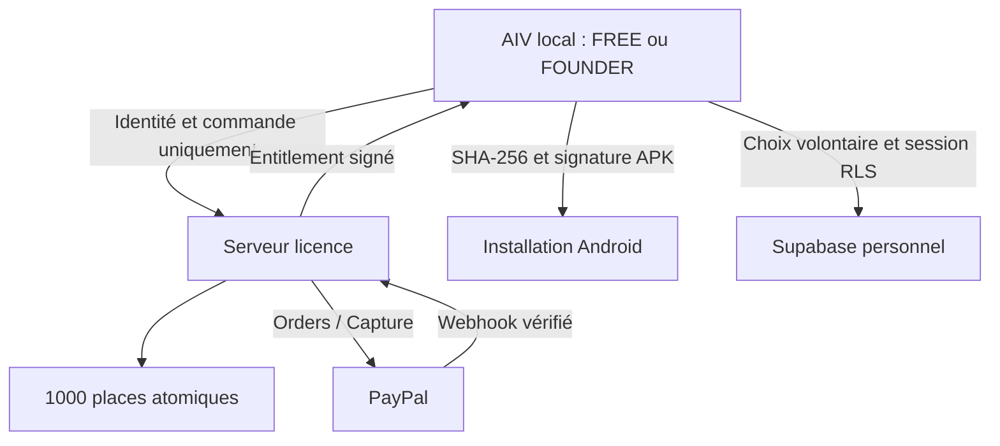

# AIV Free / Founder — séparation de la baseline 2.2.4-final

Référence : `bf1e2264bd54bbbf9c45c2080531668777495f5d`, branche `aiv-rollback-2.2.2-build224`, package `com.allinvisible.aiv`, versionCode 224. Tag de référence : `aiv-2.2.4-final-baseline-20261007`.

Un seul `aiv-v19/app/src/main`. Le script Python existant reçoit `--edition FREE --version-code 225` ou `--edition FOUNDER_FULL --version-code 226`. Aucun second projet Android. Les deux APK contiennent les mêmes classes, capteurs, ressources et bibliothèques natives. Seuls l'édition générée, le versionCode du manifeste et les métadonnées de build diffèrent. Le nom demeure 2.2.4-final, avec l'édition affichée dans À propos / Licence.

Le journal `EventStore`, le réseau natif et les règles de corrélation/anomalies ne sont pas réécrits. Les limites UID partagé et proximité temporelle demeurent. `ProductAccess` remplace le déverrouillage propriétaire/aperçu par une preuve signée et liée à la clé EC P256 déjà détenue par Android Keystore. L'APK Founder copié ne donne aucun droit sans cette preuve. L'édition FREE demeure sans commande Shizuku même si une licence y est enregistrée; elle peut vérifier son paiement et installer l'upgrade.

Les points de contrôle sont `ControlShell` (y compris le lecteur AppOps), `PermissionControl`, `PermissionMaintenance`, `ShizukuCleanup` et `DeveloperControl`. Ils consultent une preuve vérifiée, jamais un choix de palier UI. Les algorithmes de refus, restauration et priorité des décisions manuelles restent identiques. FREE continue d'afficher les observations historiques conservées, avec indication que le relevé Shizuku supplémentaire est verrouillé. La pastille attend seulement les sous-systèmes disponibles dans l'édition.

Le backend n'a aucun endpoint journal/anomalies/capture/permissions. Les requêtes licence acceptent des champs limités. Les enregistrements sont : numéro/place, UUID licence/réservation, empreinte de clé d'installation, ID idempotent, order/capture IDs, dates, statut et blocages de paiement. Les challenges expirent; aucun email, nom, adresse, numéro de série ou historique Android n'est stocké. Les événements webhook sont réduits à ID/type/date. Aucun payload PayPal complet n'est conservé.

Les 1000 places sont réservées sous `BEGIN IMMEDIATE` avant création PayPal. Une capture complétée doit correspondre à la commande connue, au marchand configuré, à 50.00 CAD, à la réservation et à une capture finale. La capture est relue côté PayPal. `order_id` et `capture_id` sont uniques. Les remboursements/réversions/litiges bloquent l'entitlement; ils ne libèrent pas une place déjà payée. La 1001e est refusée. Si des places sont seulement réservées, le message indique une indisponibilité temporaire et ne prétend pas que 1000 personnes ont payé.

Une réservation ambiguë n'expire pas sur la seule horloge locale. `server.py --reconcile` ne libère qu'une commande PayPal VOIDED sans capture et jamais confirmée. Une création dont la réponse fut perdue est réessayée avec le même PayPal-Request-Id dans une fenêtre de 5 h; au-delà elle reste bloquée en attendant réconciliation. Aucun paiement après une annulation navigateur n'est automatiquement considéré annulé.

La licence n'expire pas. Le reçu d'autorisation signé est renouvelable et valide 7 jours; il borne le délai de prise en compte hors ligne d'une réversion. Aucun abonnement ni quota de téléphones n'est ajouté. La restauration sur la même identité utilise `/entitlement`. La récupération après désinstallation/perte de clé et la politique d'activation sur une nouvelle identité restent à définir avant diffusion publique; elles ne sont pas remplacées par un quota inventé.

Les nouveaux paramètres sont chiffrés AES-GCM, avec clé Android Keystore séparée, AAD et préférences privées. Les anciens alias, bases et préférences ne sont pas effacés. Aucune migration destructive du journal. Les confirmations de sauvegarde personnelle utilisent de nouvelles tables locales par projet + utilisateur authentifié : un ancien reçu du Supabase d'Erick ne peut pas valider une autre destination. Pas de purge automatique.
